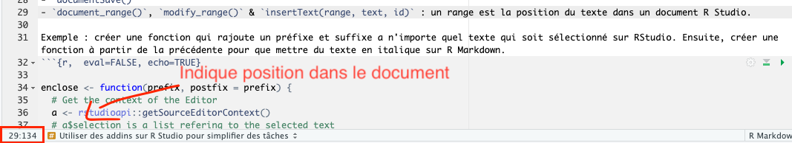

```{r setup, include=FALSE}
knitr::opts_chunk$set(echo = TRUE)
```

<!-- README.md is generated from README.Rmd. Please edit that file -->


##Il est possible d’améliorer son utilisation de RStudio à l’aide d’addins


<font size="2">*Exemple avec le package remedy développé pour rapprocher R markdown de Word.*</font>

###Utiliser rstudioapi comme base

Pour créer des addins de ce type sur Rstudio on peut utiliser le package `rstudioapi`

Ce package permets d'utiliser l'api de Rstudio pour :

1 - Manipuler des documents. 

- `documentNew()`
- `documentSave()`
- `document_range()`, `modify_range()` & `insertText(range, text, id)` : un range est la position du texte dans un document R Studio.



Exemple : créer une fonction qui rajoute un préfixe et suffixe a n'importe quel texte qui soit sélectionné sur RStudio. Ensuite, créer une fonction à partir de la précédente pour que mettre du texte en italique sur R Markdown.
```{r,  eval=FALSE, echo=TRUE}

enclose <- function(prefix, postfix = prefix) {
  # Get the context of the Editor
  a <- rstudioapi::getSourceEditorContext()
  # a$selection is a list refering to the selected text
  for (s in a$selection) {
    rstudioapi::insertText(
      location = s$range,
      text = 
        sprintf(
          "%s%s%s",
          prefix,
          s$text,
          postfix
        )
    )
  }
}
italicsr <- function() enclose("_")

```

2- Créer des dialogues avec RStudio


- `selectFile()` & `selectDirectory()`
- `askForPassword()`
- `showDialog()`. Exemple : `showDialog(title = "Test", message = "ceci est un test")`

3- Jouer avec le terminal

- `terminalCreate()`
- `terminalExecute()`
- `terminalKill()`

<span style="color:red"> Attention! `rstudioapi`dépends de fonctions internes à RStudio et donc est intimement lié à la version de RStudio.</span>

###Faire un addin

- Un addin est un package, donc il faut créer un package
- Créer une fonction
- Exécuter `usethis::use_addin()`
- Compléter les `addins.dfc`
- Cliquer sur install and restart

Autre exemple d'addin : datapasta (réduit la résistance associée au copy + paste vers R)


*Plus d'informations : https://github.com/ColinFay/user2019workshop*

