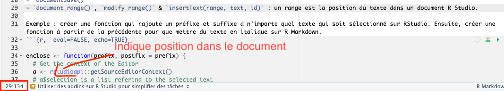
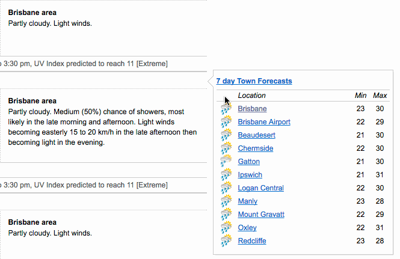

Ce que UNISIS doit retenir de UseR 2019!
================

-   [Il est possible d’améliorer son utilisation de RStudio à l’aide d’addins](#il-est-possible-daméliorer-son-utilisation-de-rstudio-à-laide-daddins)
    -   [Utiliser rstudioapi comme base](#utiliser-rstudioapi-comme-base)
    -   [Faire un addin](#faire-un-addin)
-   [Il est possible de traiter des objets sur R avec Python et viceversa.](#il-est-possible-de-traiter-des-objets-sur-r-avec-python-et-viceversa.)
-   [Il existe un outil qui permet de faire le lien entre R ou RMarkdown et Microsoft Word - StatTag](#il-existe-un-outil-qui-permet-de-faire-le-lien-entre-r-ou-rmarkdown-et-microsoft-word---stattag)
-   [Il est possible de créer des templates de scripts RMarkdown en utilisant le package usethis](#il-est-possible-de-créer-des-templates-de-scripts-rmarkdown-en-utilisant-le-package-usethis)

<!-- README.md is generated from README.Rmd. Please edit that file -->


Il est possible d’améliorer son utilisation de RStudio à l’aide d’addins
------------------------------------------------------------------------


<font size="2">*Exemple avec le package remedy développé pour rapprocher R markdown de Word.*</font>

### Utiliser rstudioapi comme base

Pour créer des addins de ce type sur Rstudio on peut utiliser le package `rstudioapi`

Ce package permets d'utiliser l'api de Rstudio pour :

1 - Manipuler des documents.

-   `documentNew()`
-   `documentSave()`
-   `document_range()`, `modify_range()` & `insertText(range, text, id)` : un range est la position du texte dans un document R Studio.



Exemple : créer une fonction qui rajoute un préfixe et suffixe a n'importe quel texte qui soit sélectionné sur RStudio. Ensuite, créer une fonction à partir de la précédente pour que mettre du texte en italique sur R Markdown.

``` r
enclose <- function(prefix, postfix = prefix) {
  # Get the context of the Editor
  a <- rstudioapi::getSourceEditorContext()
  # a$selection is a list refering to the selected text
  for (s in a$selection) {
    rstudioapi::insertText(
      location = s$range,
      text = 
        sprintf(
          "%s%s%s",
          prefix,
          s$text,
          postfix
        )
    )
  }
}
italicsr <- function() enclose("_")
```

2- Créer des dialogues avec RStudio

-   `selectFile()` & `selectDirectory()`
-   `askForPassword()`
-   `showDialog()`. Exemple : `showDialog(title = "Test", message = "ceci est un test")`

3- Jouer avec le terminal

-   `terminalCreate()`
-   `terminalExecute()`
-   `terminalKill()`

<span style="color:red"> Attention! `rstudioapi`dépends de fonctions internes à RStudio et donc est intimement lié à la version de RStudio.</span>

### Faire un addin

-   Un addin est un package, donc il faut créer un package
-   Créer une fonction
-   Exécuter `usethis::use_addin()`
-   Compléter les `addins.dfc`
-   Cliquer sur install and restart

Autre exemple d'addin : datapasta (réduit la résistance associée au copy + paste vers R)



*Plus d'informations sur :* <https://github.com/ColinFay/user2019workshop>

Il est possible de traiter des objets sur R avec Python et viceversa.
---------------------------------------------------------------------

A l'aide du package `reticulate` , R Studio 1.2 et Anaconda 3 on peut combiner les deux langages de programmation sur le même script R.

Utiliser `reticulate::use_python()` pour spécifier la version de python sur laquelle on veux travailler (et qui se trouve sur l'ordinateur).

La fonction `repl_python()` crée un console Python interactive sur R. Les objects crés sur Python sont disponibles sur R et viceversa.


Les objets crées sur python ne s'affichent pas dans l'onglet environnement mais ce trouvent bien là.

*Plus d'informations sur :*

-   <https://github.com/3mmaRand/useR2019_tutorial>
-   <https://3mmarand.github.io/useR2019_tutorial/#1>

Il existe un outil qui permet de faire le lien entre R ou RMarkdown et Microsoft Word - StatTag
-----------------------------------------------------------------------------------------------

Le développment de ce plugin pour Word est la coséquence de la frustration de l'auteur lorsque ce dernier envoyait un document RMarkdown à des collègues et ceux-ci lui envoyaient des corrections sur Word. A ce moment là la personne avait 2 choix (l'un aussi mauvais que l'autre):

-   Incorporer les corrections sur R Markdown
-   Continuer en utilisant Microsoft World

StatTag permet d'incorporer l'output de logiciels tels que R, SAS et STATA et les incorporer comme des calculs sur Word.

Voir la vidéo explicative ici : <https://www.youtube.com/watch?v=K3QwG4LB9a4>

*Pour plus d'informations :* <https://sites.northwestern.edu/stattag/>

Il est possible de créer des templates de scripts RMarkdown en utilisant le package usethis
-------------------------------------------------------------------------------------------


Usethis est un package qui permet de créer des fichiers, des projets, des packages, des addins et autres depuis la console. Il a été conçu pour automatiser des tâches répétitives lorsque l’on commence un nouveau projet comme créer un README, créer une LICENCE, créer ou cloner un repo github, créer un fichier RMarkdown avec la même structure que d’autres qui ont déjà été faits, etc.

Voir la démo : <https://www.youtube.com/watch?v=3vsPMyTfT8I&feature=youtu.be>

Pour créer un template Rmarkdown il faut simplement suivre ces pas :

-   Créer un package (Nouveau projet → Package)
-   `usethis::use_rmarkdown_template("montemplate")`
-   Mettre à jour le document yaml et Rmd qui sont crées dans le dossier `inst/rmarkdown/templates/montemplate`
-   Installer le package
-   Créer un nouveau R Markdown File &gt; New File &gt; RMarkdown &gt; From Template

Il est possible d’ajouter des fichiers annexes (tel que des images) au Rmarkdown en ajoutant des fichiers au dossier “skeleton” et en changeant `create_dir` du `yaml` de `FALSE` a `TRUE`.

Ceci peut être utile pour l'annuaire statistique ou si on venait à faire plusieures présentations avec RMarkdown.

Pour faire des templates de scripts R il faut passer par des snippets.

Cela vaut la peine de s'intéresser à l'utilisation de usethis. Il a déjà été incorporé dans la codebase comme package compatible avec les autres.
